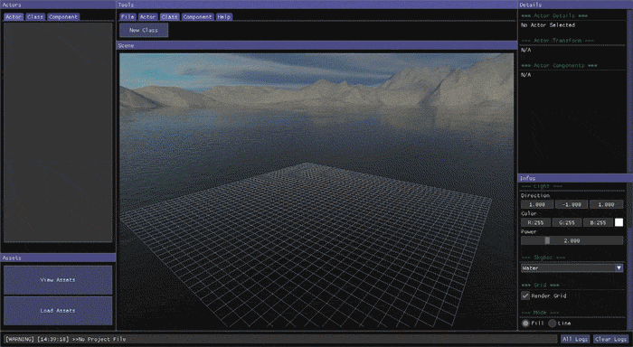
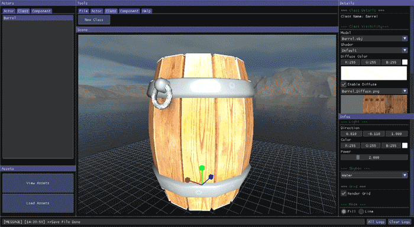
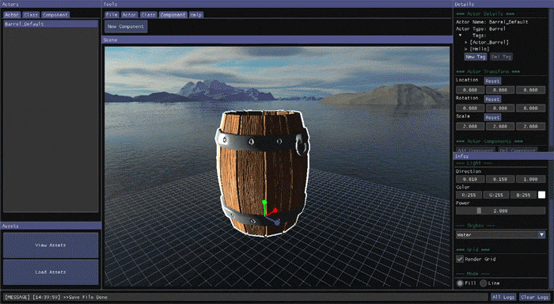
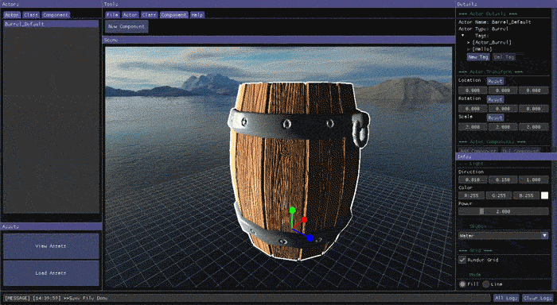
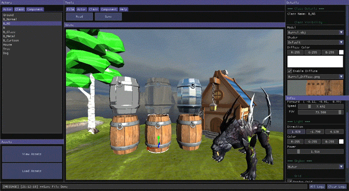
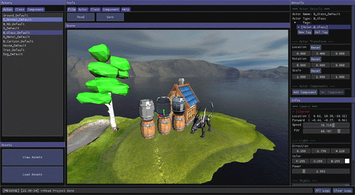
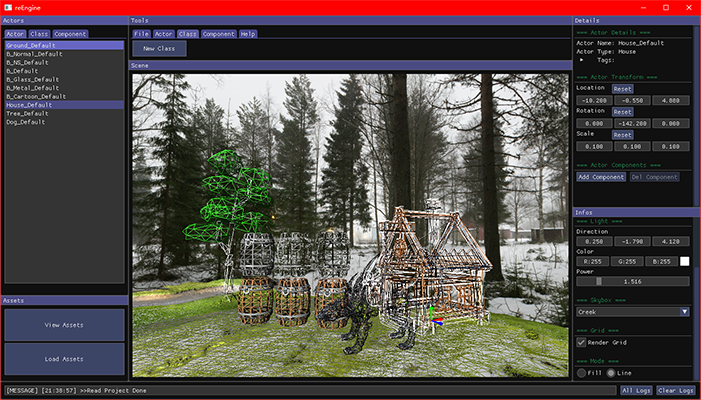
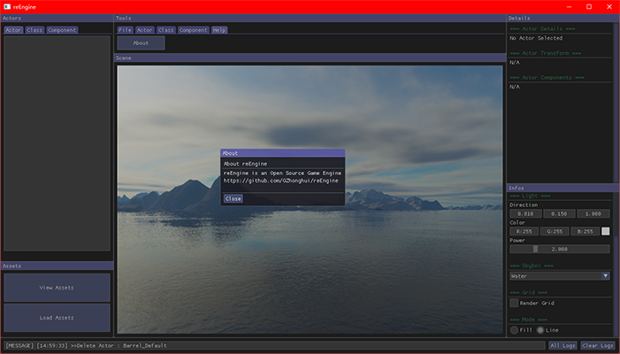

# reEngine

---
> View This Page in [中文](readMe/readMe_CN.md)/[日本語](readMe/readMe_JP.md)  
> More Projects from the reFamily [**reRender**](https://github.com/GZhonghui/reRender)/[**reSimulate**](https://github.com/GZhonghui/reSimulate)

## About
**reEngine** is a Open Source Game Engine


## Tutorial
```
01. Clone this Repository
02. Compile via Visual Studio (Only Support Windows for Now)
03. Run (as Editor)
04. Prepare and Import Assets
05. Create Classes
06. Create Actors
07. Adjust Actors in Scene
08. Add Tag to Your Actors
09. Create Components
10. Attach Components to Your Actor
11. Save Project then Close the Editor
12. Reload Visual Studio Project
13. Code for Classes and Components' Behavior
14. Edit the Config.h, Switch to Game Mode
15. Compile
16. Run (as Game)
17. You Can Switch Back to Editor Mode to Debug
```

### 🚩Editor











## Features
### ✔OpenGL Core Backend
### ✔Vulkan Backend (Working)
### ✔C++ Interface
### ✔Assets Manager
### ✔Component System
### ✔Input Event System
### ✔Quaternion Camera
### ✔Customize Skybox
### ✔Multiple Shaders
### ✔Lighting System
### ✔Editor by ImGui
### ✔Tag System

## Credits
> This Project Depends on the Following Libs
* Assimp
* Boost
* Eigen
* Glad
* GLFW
* GLM
* ImGui
* OpenGL Core
* STB
* Vulkan
