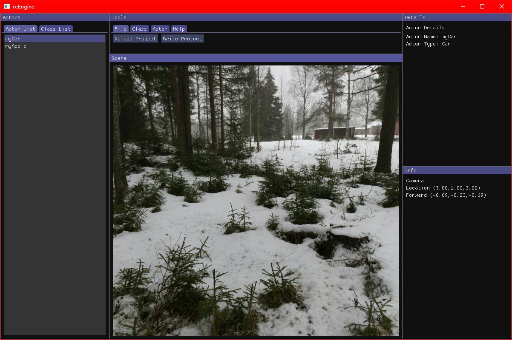
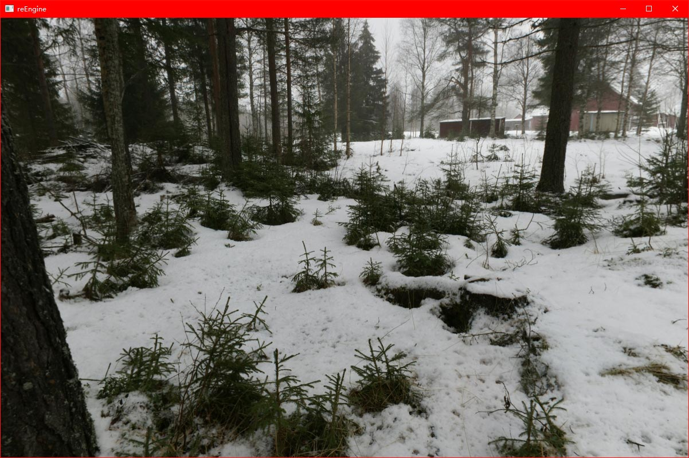

# reEngine

---
> View This Page in [中文](readMe/readMe_CN.md)/[日本語](readMe/readMe_JP.md)  
> More Projects from the reFamily [**reRender**](https://github.com/GZhonghui/reRender)/[**reSimulate**](https://github.com/GZhonghui/reSimulate)

## About
**reEngine** is a Open Source Game Engine


## Tutorial
Please Watch this [Youtube Video](https://www.youtube.com/channel/UCa0G_UHT3j2vzTHHy_2CN2w)
```
1. Clone this Repository
2. Compile with Visual Studio 2019
3. Run (as Editor)
4. Create Classes and Import Assets
5. Create Actors
6. Design the Scene
7. Save Project then Close the Editor
8. Reload Visual Studio Project
9. Code
10. Edit the Config.h, Switch to Build Game Mode
11. Compile
12. Run (as Game)
```

### 🚩Editor

### 🚩Game


## Features
### ✔Vulkan Backend
### ✔OpenGL Core Backend
### ✔C++ Reflection
### ✔C++ Scripts
### ✔Import Assets
### ✔Editor by ImGui

## Credits
> This Project Depends on the Following Libs
* Assimp
* Boost
* Eigen
* Glad
* GLFW
* GLM
* ImGui
* OpenGL Core
* STB
* Vulkan
