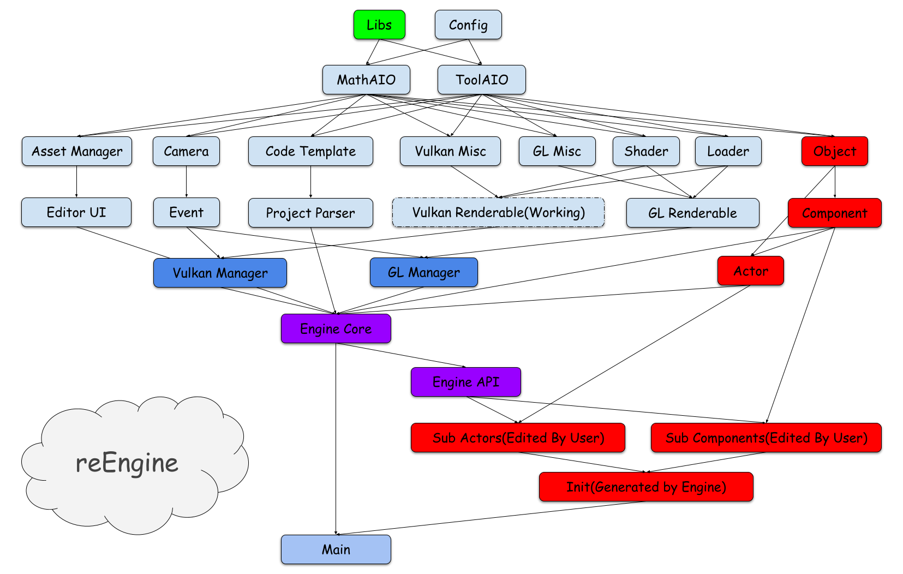

# reEngine

---
> View This Page in [中文](readMe/readMe_CN.md)/[日本語](readMe/readMe_JP.md)  
> More Projects from the reFamily [**reRender**](https://github.com/GZhonghui/reRender)/[**reSimulate**](https://github.com/GZhonghui/reSimulate)

## About
**reEngine** is a Open Source Game Engine



## Tutorial
Please Watch this Video(Working)
```
01. Clone this Repository
02. Compile (Only Support Windows for Now)
03. Run (as Editor)
04. Prepare and Import Assets
05. Create Classes
06. Create Actors
07. Place Actors in Scene
08. Save Project then Close the Editor
09. Reload Visual Studio Project
10. Code for Class's Behavior
11. Edit the Config.h, Switch to Build Game Mode
12. Compile
13. Run (as Game)
```

### 🚩Editor


## Features
### ✔Vulkan Backend
### ✔OpenGL Core Backend
### ✔C++ Scripts
### ✔Import Assets
### ✔Camera
### ✔Editor by ImGui

## Credits
> This Project Depends on the Following Libs
* Assimp
* Boost
* Eigen
* Glad
* GLFW
* GLM
* ImGui
* OpenGL Core
* STB
* Vulkan
