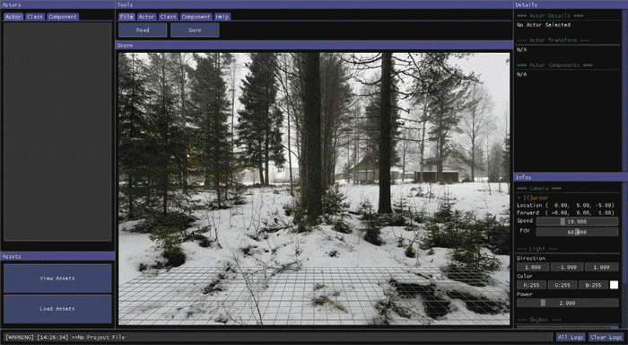
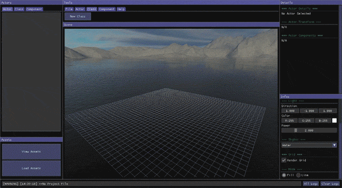

# reEngine

---
> More Projects from the reFamily [**reRender**](https://github.com/GZhonghui/reRender)/[**reSimulate**](https://github.com/GZhonghui/reSimulate)

## について
**reEngine**はオープンソースのゲームエンジンです


## 解説
```
01. コードをダウンロード
02. Visual Studioでコンパイルする
03. エディターを起動
04. 素材の準備と輸入
05. Classをクリエイトする
06. Actorをクリエイトする
07. SceneでActorのプロパティを調整する
08. ActorでTagを追加することができます
09. Componentをクリエイトする
10. ActorでComponentを追加することができます
11. 保存してエディターを閉じる
12. Visual Studioのプロジェクトをリロードする
13. ClassとComponentのコードを書く
14. Config.hをエディターする, コンパイルゲームモードへの切り替え
16. ゲームを起動
17. いつでもエディターモードに戻してデバッグすることができます
```

### 🚩エディター
| スクリーンショット |
:-:
| エディターUIとスカイボックスのカスタマイズ |
|  |
| 資産マネージャー |
|  |
| 新Classの追加 |
|  |
| 複数のシェーダー |
|  |
| タグシステム |
|  |
| 四季折々のカメラ |
|  |
| 照明システム |
|  |
| 複雑なシーン |
|  |
| ラインモードでのレンダリング |
|  |
| について |
|  |

## 特徴
### ✔OpenGL Coreバックエンド
### ✔Vulkanバックエンド (開発中)
### ✔C++インターフェース
### ✔資産マネージャー
### ✔コンポーネントシステム
### ✔入力イベントシステム
### ✔四季折々のカメラ
### ✔スカイボックスのカスタマイズ
### ✔複数のシェーダー
### ✔照明システム
### ✔ImGuiに基づくエディター
### ✔タグシステム

## クレジット
> このプロジェクトは以下のライブラリに依存しています
* Assimp
* Boost
* Eigen
* Glad
* GLFW
* GLM
* ImGui
* OpenGL Core
* STB
* Vulkan
